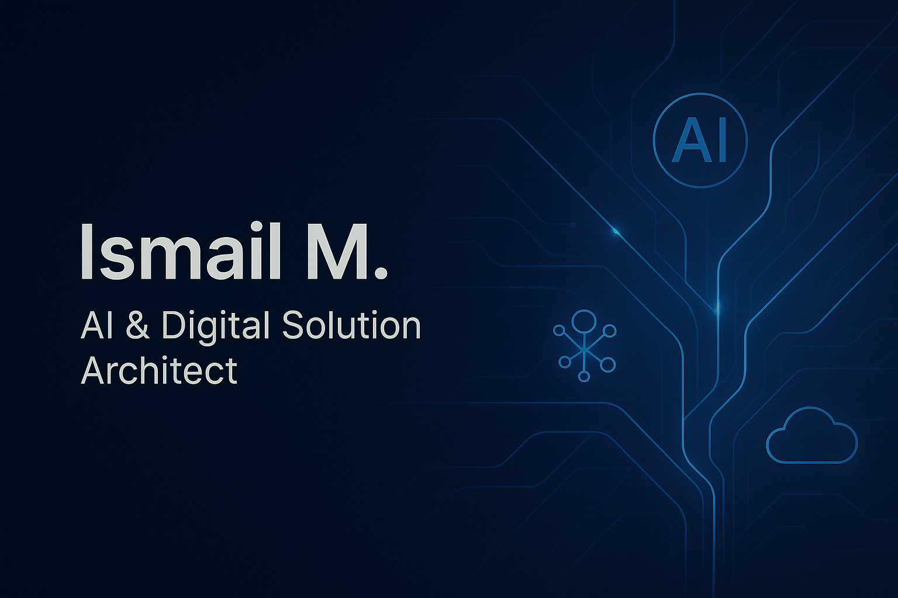

---

**`**AI & Digital Solution Architect**`**

## 🚀 About Me

I am **Ismail M.**, an **AI & Digital Solution Architect** specializing in:

- **AI automation** (N8N, OpenAI, multi-platform workflows)
- **IT infrastructure engineering** (firewalls, VLANs, Jamf, networks, CCTV)
- **SaaS & digital products** (marketing automation, content creation, API systems)
- **EdTech platforms & digital learning ecosystems**

With 7+ years of experience leading IT & digital transformation projects, I focus on building **scalable, automated, and intelligent systems** that simplify workflows, improve user experience, and enable impactful digital products.

---

  

<h1 align="center">Hi there, I'm Ismail 👋</h1>

<h3 align="center">AI & Digital Solution Architect | Systems & Network Engineer | EdTech & Automation Innovator</h3>

  

## ⭐ Main Focus Areas

- **AI Automation & Intelligent Workflows**
- **SaaS Platforms & Backend Engineering**
- **IT Infrastructure & Network Architecture**
- **EdTech Product Development (Amaly Kids Club)**
- **Digital Innovation & Multi-platform Integration**

---

## 🌟 Featured Projects

### 🔥 1. **AI Content Factory**
A fully automated AI-powered content production pipeline using **N8N**, **OpenAI**, **Replicate**, and multi-platform posting.

---

### 🎨 2. **ViralLobby Studio**
AI-driven marketing automation suite (content creation, caption writing, scheduling, autoposting).

---

### 🤖 3. **SocialHub AI (Python Automation)**
Backend system for automatic posting to Instagram, TikTok, YouTube, Facebook + token refresh + N8N integration.

---

### 🎓 4. **Amaly Kids Club LMS**
EdTech platform integrating Moodle/TutorLMS with interactive SDG-based learning content.

---

## 🧰 Tech Stack & Tools

### 💻 Programming & Scripting
- **Python, JavaScript (Node.js), PHP, Bash**

### ⚙️ Frameworks & Platforms
- **N8N**
- **FastAPI, Flask**
- **React / Next.js**
- **WordPress / WooCommerce**

### ☁️ Cloud, Hosting & DevOps
- **Docker**
- **Railway**
- **Vercel**
- **Cloudflare**
- **GitHub Actions**

### 🛡️ IT Infrastructure & Security
- **pfSense**, **Sophos XG**
- **Jamf School** (MDM for iPads)
- **Cisco / HP / Uniview** switching & CCTV
- **Advanced VLAN Architecture**

---

## 🌍 A bit more about me

- 🇲🇦 Based in **Casablanca, Morocco**
- 💡 Always building something new with **AI**
- 🎯 Passionate about **education, automation, and digital impact**
- 🛠️ Enjoy turning real-world problems into automated solutions

---

## 📫 Get in Touch

- **LinkedIn:** [Ismail Merzouk](https://www.linkedin.com/in/ismail-merzouk-3b5244b8/)

---

## 📊 GitHub Stats

  
  

---

<h3 align="center">🚀 Always building. Always learning. Always shipping.</h3>
